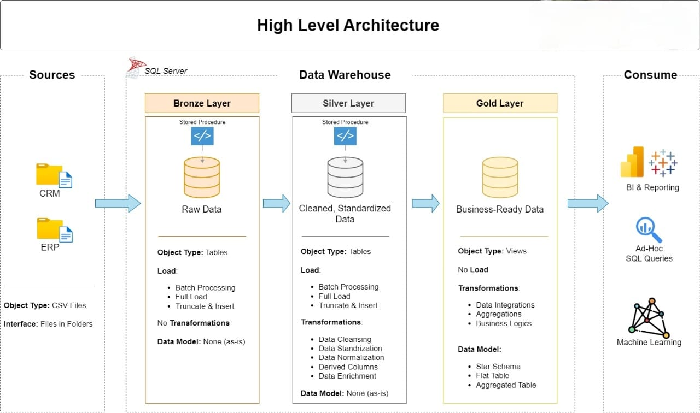
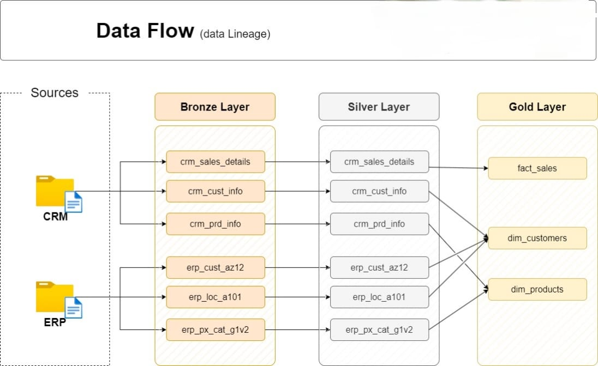
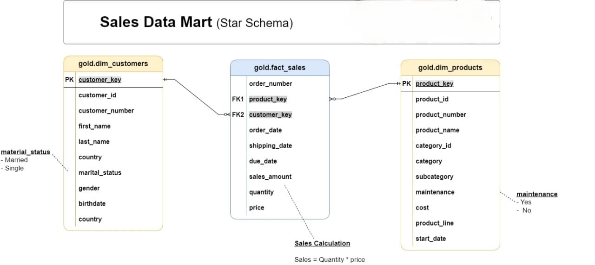
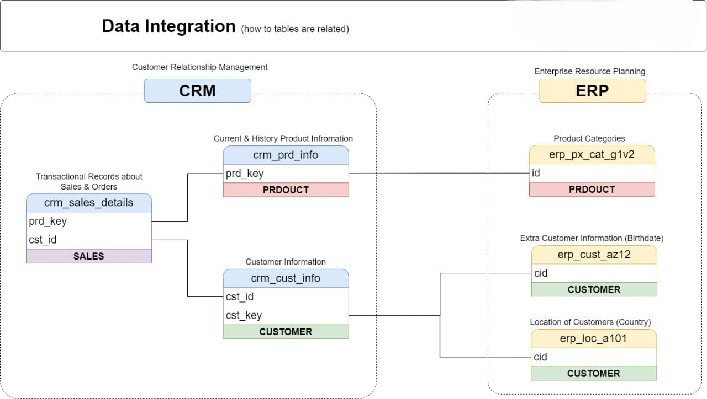
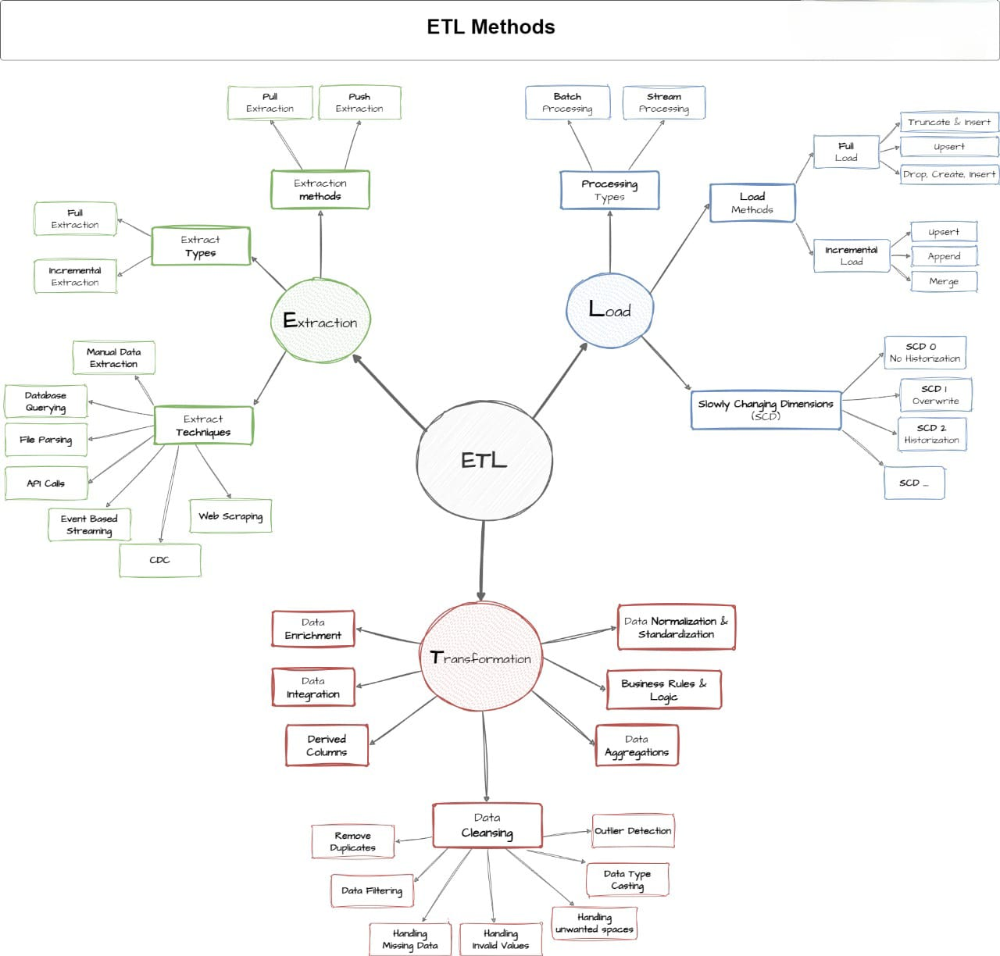

# SQL Server Data Warehouse & ETL – Retail Analytics (Medallion Architecture)

## 📌 Project Overview

This project demonstrates the design and implementation of an **end-to-end Data Warehouse** using **SQL Server**, following the **Medallion Architecture (Bronze–Silver–Gold)**.

The use case simulates a **retail business**, integrating data from **CRM (Customer Relationship Management)** and **ERP (Enterprise Resource Planning)** systems, performing ETL (Extract, Transform, Load), applying **dimensional modeling (Star Schema)**, and delivering **analyst-ready data marts**.

The project is designed to showcase skills relevant for **Data Engineers, Data Analysts, and Data Scientists**.

---

## 🎯 What This Project Solves (Business Case)

Retail companies often struggle with **fragmented customer, product, and sales data** across CRM and ERP systems.

This project solves that problem by:

- **Integrating** CRM & ERP sources into a unified warehouse.
- **Standardizing & cleansing** data to ensure quality.
- **Modeling** sales using a **Star Schema** for fast analytics.
- Delivering **business insights** like revenue trends, customer behavior, and product performance.

---

## 🏗️ Architecture

### Medallion Architecture

- **Bronze** → Raw ingestion from CRM & ERP sources (CSV).
- **Silver** → Cleansed & transformed tables (joins, deduplication, data type checks).
- **Gold** → Star Schema (fact_sales + dimension tables).

📌 *Diagram reference: Medallion architecture pipeline (bronze → silver → gold)*



---

### 🔄 Data Flow & Lineage

This diagram illustrates the **flow of data from source systems (CRM & ERP) through the Medallion layers**, showing lineage and transformations across Bronze, Silver, and Gold layers.

📌 *Diagram reference:



---
## 📂 Data Modeling – Star Schema

The **Gold Layer** is structured in a **Star Schema** for efficient analytics:

- **Fact Table – `fact_sales`**

  - Metrics: `sales_amount`, `quantity`, `price`
  - Context: `order_number`, `order_date`, `shipping_date`, `due_date`
  - Foreign keys to dimensions
- **Dimension Tables**

  - `dim_customers` → customer attributes (id, name, country, gender, marital_status, birthdate)
  - `dim_products` → product attributes (id, name, category, subcategory, cost, maintenance flag)
  - `dim_date` → calendar attributes for time-series analysis

📌 *Diagram reference: Star Schema model*



---

## 🔄 Data Integration Process

CRM & ERP integration modeled as:

- **CRM** → Sales details, customer info, product info
- **ERP** → Product categories, customer locations, additional customer attributes

**Integration bridges:**

- `CUSTOMER` entity integrates CRM + ERP customer data
- `PRODUCT` entity integrates CRM + ERP product data

📌 *Diagram reference: CRM–ERP integration process*

---

## ⚙️ ETL Process

1. **Bronze Layer** – Load raw CSVs into staging tables
2. **Silver Layer** – Apply transformations:
   - Data type enforcement
   - Deduplication
   - Null checks
3. **Gold Layer** – Build star schema (fact + dimensions)
4. **Analytics Layer** – Create business-ready views & KPIs

**Performance Optimizations:**

- Used **BULK INSERT** for efficient loading
- Applied **indexes** on keys for faster joins
- Partitioned large fact tables (optional for scaling)

📌 *Diagram reference: Visualize the ETL steps per Medallion layer.*


---

## 📊 Analytics & KPIs

From the **Gold Layer**, the following KPIs and insights are generated:

- **Revenue by Product Category**
- **Total Units Sold per Month**
- **Average Order Value (AOV)**
- **Repeat Purchase Rate by Customer**
- **Customer Segmentation by Country & Demographics**
- **Sales Trends (Monthly/Quarterly)**

``` 
“The Gold Layer also enables predictive modeling use cases, e.g., churn prediction, demand forecasting, and customer segmentation using ML.”
```

📌 *Diagram reference: Power BI / SQL query output samples*

---

## 🚀 Runbook (How to Run)

1. Clone this repository
2. Import datasets from `datasets/` folder into SQL Server
3. Run ETL scripts in order:
   - `scripts/bronze_load.sql`
   - `scripts/silver_transform.sql`
   - `scripts/gold_star_schema.sql`
4. Run `scripts/analytics_queries.sql` for KPIs
5. (Optional) Connect to Power BI / Tableau for visualization

---

## 📂 Repository Structure

```
SQL-DataWarehouse-ETL-Analytics/
│── datasets/        # CRM & ERP CSV files
│── docs/            # Diagrams & documentation
│── scripts/         # ETL SQL scripts (bronze, silver, gold, analytics)
│── tests/           # Data quality & validation scripts
│── README.md        # Project documentation
│── LICENSE
```

---

## 👥 Target Audience

- **Data Engineers** → Learn ETL, Medallion design, data quality checks
- **Data Analysts** → Query-ready star schema, KPIs, and reporting models
- **Data Scientists** → Gold layer feeds ML models for churn, forecasting, etc.

---

## 🌟 About Me

Hi! I’m **Mubasshir Ahmed** — a **Data Science & GenAI Enthusiast** with a strong foundation in **SQL, Python, ML, and ETL pipelines**.

I transitioned from MERN Development into **Data & AI engineering**, focusing on building **AI-powered and data-driven solutions**.

🎯 Career Vision → To grow into roles such as **Data Scientist**, **AI Engineer**, or **GenAI Developer**, where I can architect intelligent, scalable, and human-centered solutions.

---

## 🔗 Connect With Me

[](https://www.linkedin.com/in/mubasshir3712/)
[](https://github.com/mubasshirahmed-3712)
[](https://www.notion.so/SQL-DataWarehouse-ETL-Project-250eeb980be5801ea338d7de71c65c45)
[](https://instagram.com/badhshah._09)

---

⚡ *Designed with a Medallion mindset: Raw → Refined → Insights* ⚡
